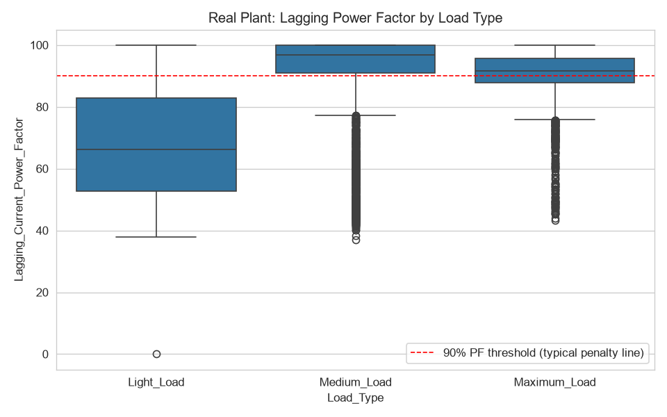
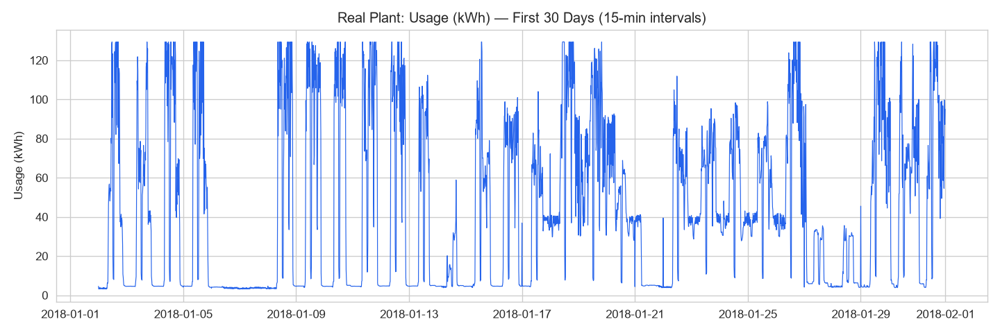

# Energy Consumption Forecasting & Optimization

[](https://industrial-energy-forecasting-r68qnqof8xkhnqm8e2y2m4.streamlit.app/)


Short-term electricity forecasting for an industrial plant, paired with peak-demand and power-factor analysis that points to concrete cost savings.

**Live demo:** https://industrial-energy-forecasting-r68qnqof8xkhnqm8e2y2m4.streamlit.app/

## Highlights

- 15-minute-ahead consumption forecast at 4.36 kWh MAE (R2 0.92) on a full year of real steel-plant meter data, using only information available at forecast time
- Power-factor deficiency quantified: below the 90% penalty threshold 54.8% of the time, concentrated in Light_Load periods with a median of 66.2%
- Peak-demand timing isolated to 9 AM Thursdays, giving a clear load-shifting target under a demand tariff
- Interactive Streamlit demo with what-if sliders backed by serialized XGBoost and LightGBM models

## Demo

Open the live demo and try the what-if panel: change the hour, day of week, or recent usage and watch both models re-forecast instantly. The forecast page also shows actual vs predicted over the held-out test period, feature importance, and the power-factor diagnostic.




## Problem

Industrial sites pay for energy twice: per kWh consumed and again through peak-demand charges and power-factor penalties. This project answers three questions a plant engineer would ask: how much power will we draw in the next interval, when do costly peaks occur, and where is reactive-power waste concentrated.

## Approach

The primary pipeline runs on real 15-minute data from DAEWOO Steel Co., Gwangyang, South Korea (UCI ML Repository, 34,944 rows, 2018). Steps: cleaning and outlier capping, time plus Fourier seasonal plus lag and rolling features, chronological 80/20 split, GridSearch-tuned XGBoost against a linear baseline and LightGBM, then SHAP and residual diagnostics. Same-timestep electrical readings (reactive power, power factor, CO2) are deliberately excluded from forecast inputs to avoid target leakage and are modeled separately for illustration only.

A secondary synthetic pipeline (hourly data with furnace, compressor, ventilation and auxiliary sub-metering) demonstrates the same method with full equipment-level attribution. Details are kept short below; see `real_data/README.md` for the real-data write-up.

## Results

| Model | MAE | MAPE | R2 |
|---|---|---|---|
| Linear Regression | 6.65 kWh | 57.6% | 0.863 |
| XGBoost (GridSearch) | 4.53 kWh | 25.4% | 0.923 |
| LightGBM | 4.36 kWh | 21.5% | 0.924 |

MAPE reads high because consumption falls near zero when the plant idles; MAE is the operating metric, roughly 16% of the 27 kWh mean. The prior 15-minute reading dominates importance at about 53%, followed by weekend flag, hour, day of week and same-time-yesterday load, which fits an autocorrelated series.

Load share: Maximum_Load 44.9%, Medium_Load 38.9%, Light_Load 16.2%. Power factor is healthy at Medium (median 96.8%) and Maximum (91.7%) load but collapses during Light_Load (66.2%, under 90% nearly 80% of the time). Peaks, defined as the top 5% of readings over 99.1 kWh (1,749 intervals), cluster at 9 AM on Thursdays.

## Business impact

- Power-factor correction: an automatic switched capacitor bank engaged during Light_Load periods targets the penalty exposure; a fixed bank would overcorrect at light load
- Peak shaving: shifting non-critical load out of the Thursday 9 AM window cuts demand charges without reducing output
- Scheduling: the 15-minute forecast supports day-ahead staffing and equipment staging decisions

## Skills

Forecasting: XGBoost, LightGBM, scikit-learn, GridSearchCV, chronological validation, leakage-aware feature design (lags, rolling statistics, Fourier seasonality). Analysis: pandas, NumPy, matplotlib, seaborn, SHAP values, residual analysis, correlation and quantile-based anomaly flagging. Deployment: Streamlit, Plotly, joblib model serialization, GitHub, Streamlit Community Cloud.

## Repository layout

```
data/generate_data.py        synthetic hourly data with equipment breakdown
clean_features.py            cleaning and features (synthetic)
eda.py                       exploratory plots -> outputs/
train_model.py               baseline vs tuned XGBoost vs LightGBM, SHAP, residuals
optimization.py              wastage flags, equipment ranking, peak analysis
dashboard/app.py             Streamlit dashboard (synthetic)
real_data/                   real-data pipeline (primary): cleaning, EDA,
                             forecasting, optimization, dashboard_real.py
requirements.txt             demo dependencies
```

## Run locally

Real pipeline (primary):

```bash
pip install -r requirements.txt
python real_data/eda_real.py
python real_data/train_model_real.py
python real_data/optimization_real.py
streamlit run real_data/dashboard_real.py
```

Synthetic pipeline (appendix):

```bash
pip install -r requirements.txt
python data/generate_data.py
python clean_features.py
python eda.py
python train_model.py
python optimization.py
streamlit run dashboard/app.py
```

Tested on Python 3.12 on Windows. EDA and optimization finish in under a minute; real training includes a small GridSearch and takes several minutes, while the larger synthetic GridSearch can take 20 to 40 minutes.

## Limitations and next steps

Single-site, single-year data, so transfer to another plant needs recalibration. No weather, production-schedule or tariff inputs were available; adding them should improve peaks and economics. Cost estimates above assume a standard penalty and demand-tariff structure and should be validated against the site's actual bill.
